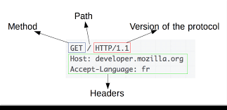
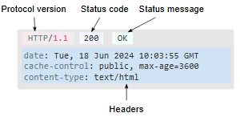

# 2-Dars HTTP verbs, endpoints and status codes

- https://github.com/umidgaybullayev -- URL

- http -- schema

- www.google.com -- hostname

- /umidgaybullayev -- optional path

## HTTP METHODS --> CRUD operatsiyalari

- CRUD:
  - CREAT <---> POST REQUEST
  - READ <---> GET
  - UPDATE <---> PUT(PATCH)
  - DELETE <---> DELETE

#### WEBSITE -- HTML, CSS, IMAGES, JS lardan tashkil topadi.

#### WEB API -- endpoints y'ani CRUD http requestlarini jo'natish orqali amalga oshirishimiz mumkin bo'lgan URL lar to'plami.

WEB API ning backend qismida endpointlar ro'yhati bo'ladi.

1. https://www.mysite.uz/api/books -- GET request - barcha kitoblarni jo'natadi.
2. https://www.mysite.uz/api/books/id -- Birgina kitobni (id ga ko'ra) bizga qaytaradi.
3. https://www.mysite.uz/api/users -- GET request -> barcha userlarni bizga jo'natadi.
4. https://www.mysite.uz/api/books/ -- POST request -> kitobni nomi, muallifi, necha betligi, narxi, ISBN

```python
    {
    "title":"Kecha va Kunduz",
    "author":"Cho'lpon"
    }
```


> [!NOTE] 
> http request 3 ta komponentdan iborat boladi.

Ular:
1) Status(Request) lang
2) Headers
3) Optional body





Response

